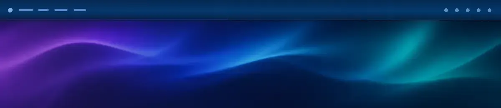
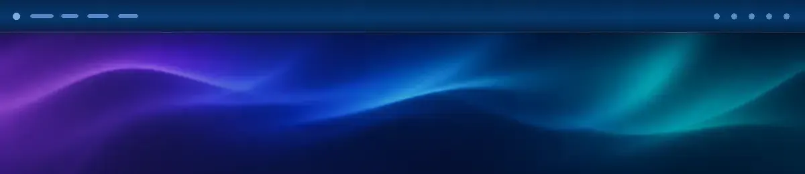
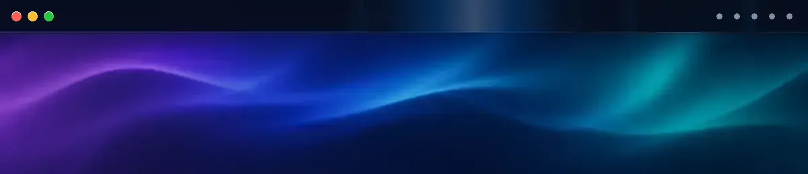
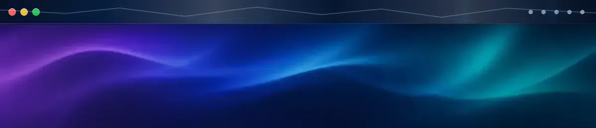
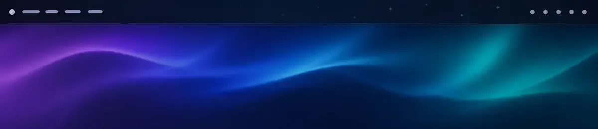
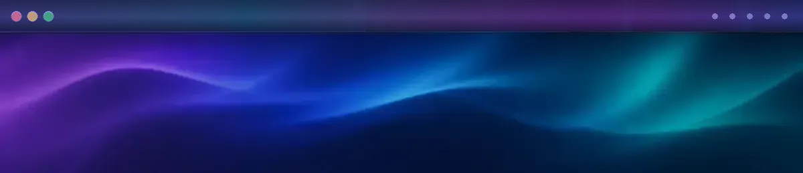

<p align="center">
  
</p>

<h1 align="center">BarBop</h1>

<p align="center">
  Make your macOS menu bar react to clicks and visible notification banners.
</p>

<p align="center">
  <a href="https://github.com/hsc03/BarBop/releases/latest/download/BarBop.zip">
    
  </a>
</p>

<p align="center">
  <a href="https://github.com/hsc03/BarBop/releases/latest"></a>
  
  
  
  <a href="LICENSE"></a>
</p>

---

## Make the menu bar react

BarBop adds short, colorful reactions to a part of macOS you already use all
day. Click the menu bar or receive a visible notification banner and BarBop
plays a lightweight, click-through effect without opening another window.

Click and notification triggers are independent. Their appearance is shared,
so one color palette and timing setup keeps every reaction consistent.

## See every style

Choose a quick flash, a focused pulse, a traveling sweep, an electric strike,
a field of tiny highlights, or a three-color aurora. Every overlay ignores
mouse input and disappears as soon as the animation ends.

<table width="100%">
  <tr>
    <td width="50%" valign="top">
      
      <h3 align="center">Flash</h3>
      <p align="center">A crisp full-width response for the fastest feedback.</p>
    </td>
    <td width="50%" valign="top">
      
      <h3 align="center">Pulse</h3>
      <p align="center">A full-width glow that breathes in two soft beats.</p>
    </td>
  </tr>
  <tr>
    <td width="50%" valign="top">
      
      <h3 align="center">Sweep</h3>
      <p align="center">A bright streak that travels across the bar.</p>
    </td>
    <td width="50%" valign="top">
      
      <h3 align="center">Lightning</h3>
      <p align="center">A brief branching strike with an electric edge.</p>
    </td>
  </tr>
  <tr>
    <td width="50%" valign="top">
      
      <h3 align="center">Shimmer</h3>
      <p align="center">Small star-like highlights scattered across the bar.</p>
    </td>
    <td width="50%" valign="top">
      
      <h3 align="center">Aurora</h3>
      <p align="center">A flowing gradient made from three editable colors.</p>
    </td>
  </tr>
</table>

## React to visible notifications

Notification Effects react to banners that macOS actually places on screen.
BarBop observes only public Accessibility structure and geometry; it does not
read the notification title, body, source app, or button labels.

> [!IMPORTANT]
> Notification Effects are experimental and off by default. They require
> Accessibility access, while Click Effects work without that permission.

## Put the effect on the right display

Clicks always react on the display you clicked. Notifications can follow the
banner, target the current main display, stay assigned to a specific monitor,
or play across every connected display at once. A disconnected fixed monitor
falls back to the main display and automatically returns when reconnected.

## Install

### Homebrew

```sh
brew install --cask hsc03/tap/barbop
open -a BarBop
```

Homebrew installs applications without launching them. Open BarBop once, then
enable **Launch BarBop at Login** if you want it available after every sign-in.

### Direct download

Download the signed and notarized `BarBop.zip` from the
[latest GitHub Release](https://github.com/hsc03/BarBop/releases/latest), unzip
it, and move `BarBop.app` to `/Applications`.

### Requirements

- macOS 26.5 or later
- Apple silicon

## Quick start

1. Open BarBop and find the Aurora Bar icon in the macOS menu bar.
2. Choose a style, color or Aurora palette, opacity, and duration.
3. Keep **Click Effects** enabled for reactions to menu bar clicks.
4. Optionally enable **Notification Effects** and approve Accessibility access.
5. Choose where notification effects appear.

BarBop respects Reduce Motion, saves settings locally, recovers corrupted
settings safely, and supports signed in-app updates through Sparkle 2.

## Permissions and privacy

Click Effects observe mouse-down events and screen geometry. BarBop does not
observe keyboard events or save click history.

For Notification Effects, BarBop reads the Accessibility event type, element
identity, role, subrole, frame, parent depth, timing, and a derived display ID.
It does **not** read or store:

- notification titles or bodies
- source app names or button labels
- screenshots, screen pixels, or OCR output
- Notification Center databases or system logs

BarBop has no analytics and sends no effect, click, notification, or settings
data. Network access is limited to checking for and downloading signed updates
from this repository. See [Privacy and Permissions](docs/privacy-and-permissions.md)
for the complete boundary.

## Experimental notification limitation

Opening or closing Notification Center can occasionally expose the same public
Accessibility structure as a new banner and play one unintended effect. The
latest validation observed one false effect in ten open/close cycles.

BarBop will not work around that limitation by reading notification content,
using private APIs, accessing Notification Center databases, or capturing the
screen. Click Effects are unaffected.

## Build from source

```sh
git clone https://github.com/hsc03/BarBop.git
cd BarBop
open BarBop.xcodeproj
```

Select the `BarBop` scheme and **My Mac**, then press `Cmd + R`. Local builds
use **Sign to Run Locally** and do not require the repository owner's Developer
Team. Rebuilding or moving the app may require Accessibility approval again.

Command-line builds and tests are also supported:

```sh
xcodebuild -project BarBop.xcodeproj \
  -scheme BarBop \
  -configuration Debug \
  -destination 'platform=macOS' \
  test
```

## Development and documentation

The production app and development-only `NotificationObserverSpike` target
share `NotificationBannerCore`. The spike is never included in release
archives.

- [Documentation index](docs/README.md)
- [Architecture](docs/architecture.md)
- [Privacy and permissions](docs/privacy-and-permissions.md)
- [Application updates](docs/update-distribution.md)
- [Release process](docs/release-process.md)
- [Personal Homebrew Tap](docs/personal-homebrew-tap.md)

Read [Contributing](CONTRIBUTING.md) before opening an issue or pull request.
Security reports should follow [Security Policy](SECURITY.md).

## License

BarBop is available under the [MIT License](LICENSE).
