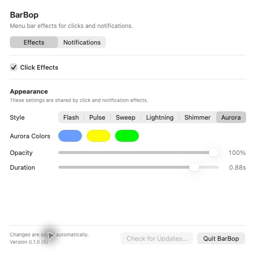

# BarBop

<p align="center">
  
</p>

<p align="center">
  A macOS menu bar utility that adds short visual effects to menu bar clicks
  and visible notification banners.
</p>



> [!IMPORTANT]
> Notification Effects are experimental and off by default. See the documented
> limitation below before enabling them.

## Features

- Independent Click Effects and Notification Effects
- Flash, Pulse, Sweep, Lightning, Shimmer, and three-color Aurora styles
- Configurable colors, opacity, and duration
- Follow-notification, main, specific, or all-display notification targeting
- Multi-display click effects that stay on the clicked display
- Reduce Motion fallback and click-through overlays
- Local settings with migration and corrupted-data recovery
- Signed in-app update support through Sparkle 2

## Requirements

- macOS 26.5 or later
- Apple silicon
- Xcode 26.6 or later when building from source

## Install

1. Download `BarBop.zip` from the
   [latest GitHub Release](https://github.com/hsc03/BarBop/releases/latest).
2. Unzip it and move `BarBop.app` to `/Applications`.
3. Open BarBop and use its Aurora Bar icon in the macOS menu bar.

Release builds are signed with Developer ID and notarized by Apple. A personal
Homebrew Tap will be added separately; no Homebrew package is published yet.

## Build from Source

```sh
git clone https://github.com/hsc03/BarBop.git
cd BarBop
open BarBop.xcodeproj
```

Select the `BarBop` scheme and **My Mac**, then run the app. A local build uses
**Sign to Run Locally** and does not require the repository owner's Apple
Developer team. Rebuilding or moving the app may require macOS to approve its
Accessibility access again.

Command-line builds are also supported:

```sh
xcodebuild -project BarBop.xcodeproj \
  -scheme BarBop \
  -configuration Debug \
  -destination 'platform=macOS' \
  build
```

## Usage

BarBop appears only in the menu bar. Click its Aurora Bar status icon to open
the attached settings popover.

- **Effects** controls click effects and the appearance shared by both triggers.
- **Notifications** controls the experimental notification trigger and its
  target display.
- **Test Notification & Troubleshooting** can send one fixed local test
  notification without enabling Notification Effects.

Click Effects work independently of Notification Effects. Notification Effects
react only to banners macOS actually displays; Focus modes and per-app delivery
settings can suppress those banners.

## Permissions and Privacy

Click Effects observe mouse-down events and screen geometry. BarBop does not
observe keyboard events or store click history.

Notification Effects require Accessibility access because BarBop observes the
public structural Accessibility events exposed by Notification Center. It reads
event type, element identity, role, subrole, frame, parent depth, timing, and a
derived display ID. It does **not** read notification titles, bodies, source app
names, button labels, screenshots, or screen pixels.

BarBop does not send analytics or effect data. Network access is limited to
checking for and downloading signed application updates from this repository
through Sparkle. See [Privacy and Permissions](docs/privacy-and-permissions.md)
for the complete data and permission boundary.

## Experimental Notification Limitation

Opening or closing Notification Center can occasionally expose the same public
Accessibility structure as a new banner and play one unintended effect. The
latest validation observed one false effect in ten open/close cycles.
Notification Effects remain off by default, and Click Effects are unaffected.

BarBop will not work around this limitation by reading notification contents,
using private APIs or Notification Center databases, or capturing the screen.

## Development

The production app and the development-only `NotificationObserverSpike` target
share `NotificationBannerCore`. The spike is not installed with BarBop and is
not included in release archives.

Run the automated checks with:

```sh
xcodebuild -project BarBop.xcodeproj \
  -scheme BarBop \
  -configuration Debug \
  -destination 'platform=macOS' \
  test
```

Read [Contributing](CONTRIBUTING.md) before opening an issue or pull request.
Security reports should follow [Security Policy](SECURITY.md).

## Documentation

- [Documentation index](docs/README.md)
- [Architecture](docs/architecture.md)
- [Privacy and permissions](docs/privacy-and-permissions.md)
- [Release process](docs/release-process.md)
- [Application updates](docs/update-distribution.md)
- [Personal Homebrew Tap](docs/personal-homebrew-tap.md)

## License

BarBop is available under the [MIT License](LICENSE).
